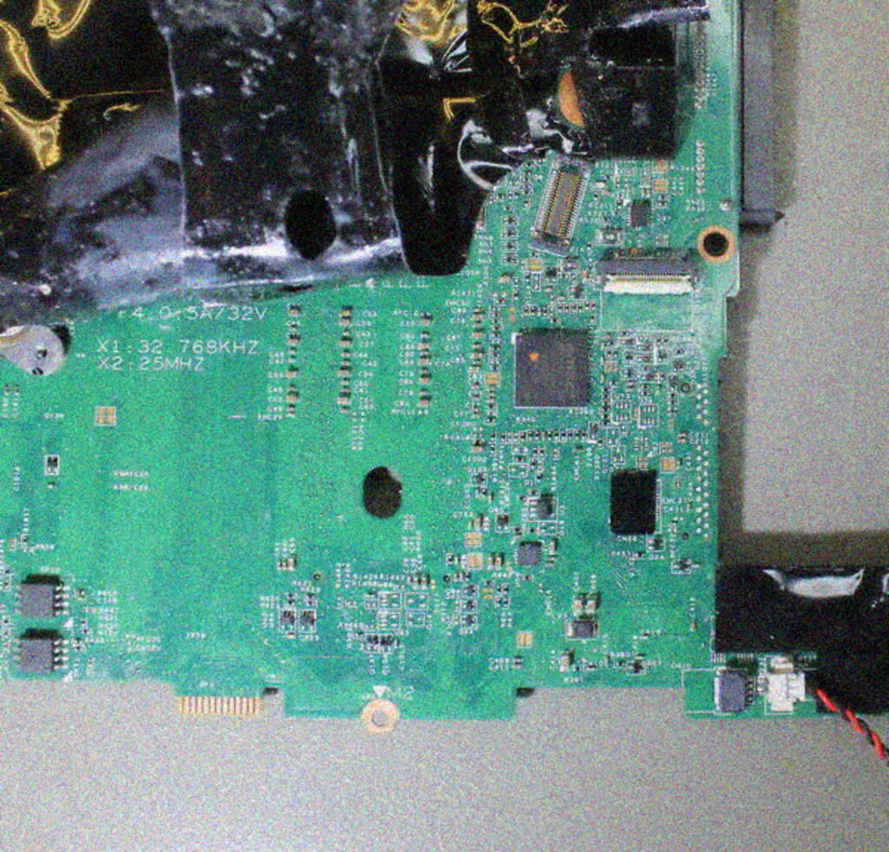
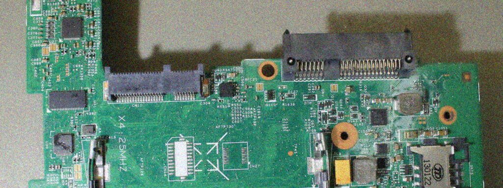
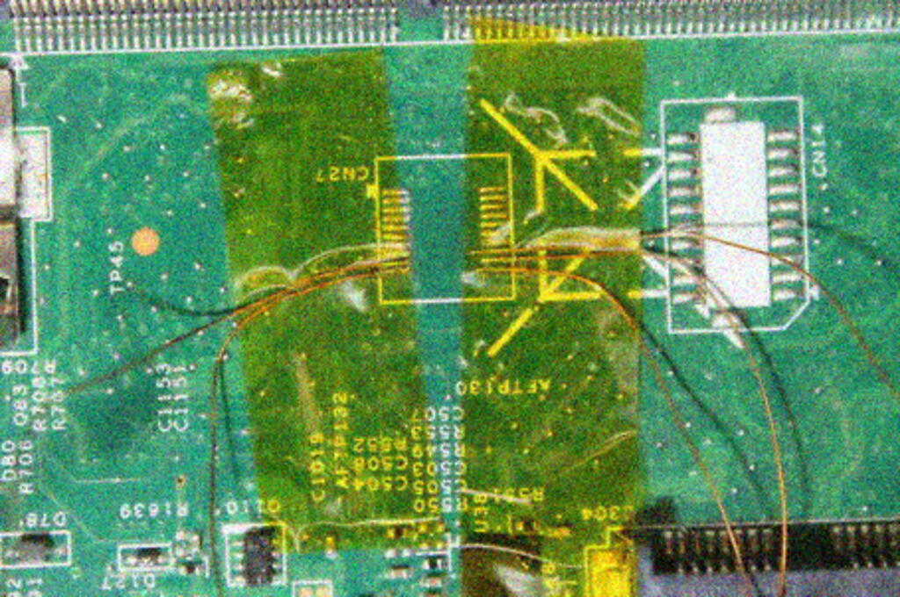
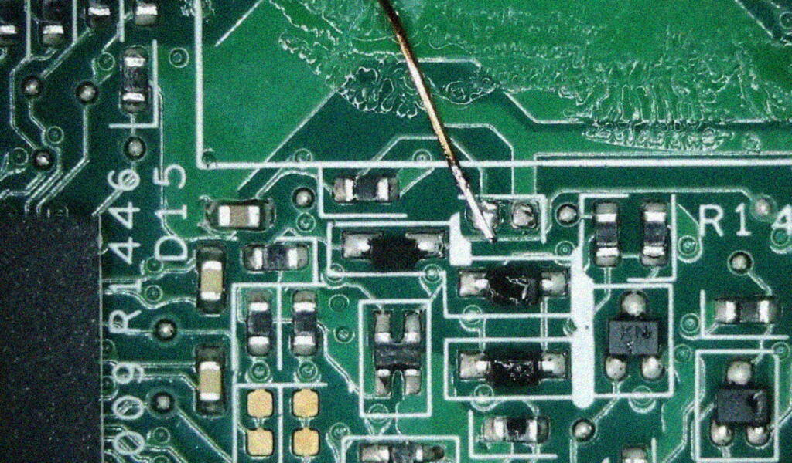
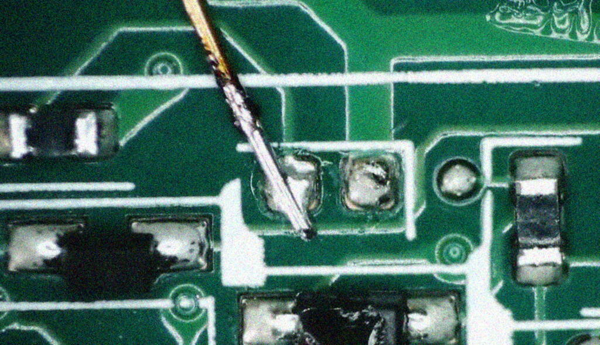

# Reading/writing the X230 EC over JTAG
Notes on reading/writing to the Lenovo X230 embedded controller via JTAG

*This document will not be maintained, long term. If you have major contributions to make and the original author does not respond to issues opened, please don't hesidate to fork it.*

## tl;dr

If you just want to get to it:
- buy an SVOD3 programmer [directly](http://svod-project.com) or from [ChipsetPro](https://www.chipsetpro.com)
- scroll down to the section on [connecting the JTAG interface](#connecting-to-jtag)
- wire it up and go.

## Technical background

The X230 embedded controller is a MEC1619, located here:

It is effectively identical to the MEC1618, and a [full reference manual](http://ww1.microchip.com/downloads/en/DeviceDoc/00002339A.pdf) is available for the MEC1618.

The firmware was first dumped by some users on [this Russian-language forum](https://ascnb1.ru/forma1/viewtopic.php?f=70&t=109179) using a closed-source tool (see the [section](#closed-sources-solutions)).

Programming the MEC16xx series over JTAG is not for the faint of heart. The [MEC16xx section](https://github.com/GlasgowEmbedded/glasgow/blob/main/software/glasgow/applet/program/mec16xx/__init__.py#L111) of the Glasgow Interface Explorer's source code demonstrates how to get around the chip's bugs.

## Open source solutions

The [Glasgow Interface Explorer](https://www.crowdsupply.com/1bitsquared/glasgow) appears to be the only open-source device which is capable of reading/writing the MEC16xx flash out of the box. Unfortunately, the hardware is not available at the time this is being written. Check the link, perhaps that has changed by the time you are reading this.

If you have the technical skill, most JTAG adapters combined with OpenOCD or UrJTAG should be able to do it. However, it's necessary to do considerable work to fully read out the memory. @four0four published the initial steps in [this issue](https://github.com/hamishcoleman/thinkpad-ec/issues/57) with OpenOCD init code [here](https://gist.github.com/four0four/680e1fa70e7c216baac2afbd459d03d8).

## Closed source solutions

The X230 firmware was originally read out over JTAG using a closed-source Russian device called the [EJTAG Tiny Tools](https://www.ejtag.ru/viewtopic.php?f=3&t=15&hilit=mec1619). However, at the time of writing this tool is only being sold to people located within Russia.

Outside Russia, there are two devices which can read and write the MEC1619 flash over JTAG:
- [SVOD3](http://shop.svod-project.com/index.php?route=common/home)
- [RT-809H](https://kphstore.com/rt-809h) also available [here](https://www.hklrf.com/RT809H-EMMC-Nand-FLASH-Programmer_3716.html) and see the [instruction manual](http://cn.hklrf.com/24download/RT809H%20programmer%20instruction0624.pdf)

The SVOD3 appears to be more popular among Western users. [One person](https://www.reddit.com/r/thinkpad/comments/ewtm36/perfect_t480_modification_with_thinkpad_25th_7row/) has already used it to modify another Thinkpad's EC firmware.

Repair technicians have [reported in forums](https://www.elektroda.com/rtvforum/topic3391403.html) that the RT-809H works for the MEC16xx series.

## Connecting to JTAG

You'll need a copy of the [X230 Schematic](http://plan9.stanleylieber.com/hardware/thinkpad/x230/x230.schematics.pdf)

Page 62 of the schematic shows the EC JTAG pins which need to be soldered to.

Most, but not all, of the necessary pins are exposed in the `CN27` debug connector, which is a set of pads on the backside of the board with pads for a surface mount connector. For the pinout see page 62 schematic PDF.

The pitch is very fine, I used 0.1mm enameled wire to connect to the pads and a fine-tip soldering iron with plenty of flux. Immediately after making the connections it is helpful to tape down the wires with Kapton tape.

The JTAG RST pin is not part of this connector, and must be tapped next to the MEC1619 chip:

